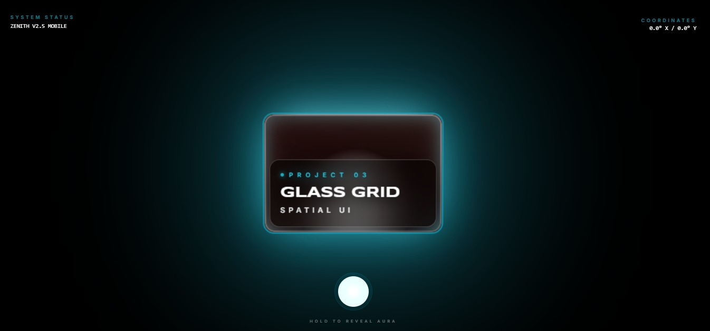

<div align="center">
  
  </div>
# 🌌 ZENITH Mobile: Spatial OS Evolution

**ZENITH Mobile** is a high-fidelity "Thumb-Centric" spatial operating system concept designed for the mobile web. It rejects traditional UI paradigms—like vertical scrolling lists and hamburger menus—in favor of **Kinetic Cylinder Physics**, **Liquid Glass Refraction**, and **Bimanual Spatial Interactions**.

---

## 💎 The "Thumb-Centric" Philosophy
Most mobile apps are designed for desktop-first layouts scaled down. ZENITH is designed around the **Thumb Zone**—the natural ergonomic arc of a human thumb.
- **The Break**: No traditional scrolling. Content exists on a 3D Z-axis.
- **Radial Accessibility**: All navigation is anchored to the bottom-center "Hub."
- **Gesture-Only Navigation**: Using pinches and flicks instead of buttons to minimize cognitive load.

---

## 🚀 Core Interaction Mechanics

### 1. The Kinetic Pillar (3D Monolith)
The primary content container is a rotating 3D glass cylinder.
- **Infinite Rotation**: Content loops seamlessly in a vertical 3D stack.
- **Grounded Physics**: Uses custom spring dynamics (Stiffness: 180, Damping: 24, Mass: 2.2) to give cards a "heavy," premium feel.
- **Kinetic Flick**: High-velocity dragging triggers an inertia-based spin that "snaps" into place with a mechanical engagement feel.
- **Tap-to-Focus**: Direct selection automatically rotates the pillar to center the target card.

### 2. Radial Pulse Navigation
Located at the bottom of the screen, the **Radial Hub** acts as the system's heartbeat.
- **Haptic Aura**: Holding the center hub triggers a 3D expanding aura and a high-frequency vibration nudge.
- **Spatial HUD**: While held, a radial indicator reveals the system's current index and total content count.

### 3. "Pinch-to-Dive" Interface
ZENITH uses scale as a primary navigation dimension.
- **Dive (Scale > 2.2x)**: Pinching open "tears" the current card open, transitioning the user into a high-density Detail View.
- **Exit (Scale < 0.8x)**: Pinching closed collapses the Detail View back into the Kinetic Pillar.
- **Haptic Reinforcement**: The system pulses with a `[5, 5]` vibration pattern every 3.5s while in Detail View to subconsciously guide the user toward the exit gesture.

---

## 🎨 Visual Engine: Liquid Glass V4
The "Liquid Glass" effect creates an unparalleled sense of depth through real-time sensor mapping.

| Feature | Technical Implementation |
| :--- | :--- |
| **Extreme Parallax** | Background layers use **40x translation multipliers** relative to device tilt. |
| **Dynamic Diffusion** | Real-time `blur` calculation (up to 28px) based on `tiltIntensity`. |
| **Chromatic Aberration** | Triple-layered RGB splits (Red/Blue) with independent high-velocity physics. |
| **Specular Glints** | 60x counter-movement glints simulating light catching on curved glass edges. |
| **Sub-Surface Scattering** | Internal box-shadows and edge glows that shift based on Gyroscope gamma/beta. |
| **Depth Scale** | Background elements are scaled to **5.0x** to provide a massive internal "void" volume. |

---

## 🔊 Sensory Feedback System (Haptics & Audio)
To make digital glass feel physical, ZENITH uses a dual-feedback approach:

### ⚡ Haptic Mapping
- **Tick**: 5ms burst during pillar rotation.
- **Catch**: 8ms burst when a flick begins to settle.
- **Engagement**: A `[10, 4, 10]` pattern when a card snaps into focus.
- **Pulse**: A rhythmic `[5, 5]` loop in the Detail View.

### 🎹 Procedural Mechanical Audio
Using the **Web Audio API**, ZENITH generates sounds in real-time (no MP3 files):
- **Mechanical Click**: A sine-wave oscillator at 600Hz with an exponential ramp down to 50Hz over 60ms.
- **Transient Pulse**: Used during navigation to simulate physical gears turning behind the glass.

---

## 🛠 Tech Stack & Performance
- **Framework**: React 19 (Concurrent Mode)
- **Animation**: Framer Motion 12 (Layout Projection & Spring Physics)
- **Gesture Control**: `@use-gesture/react` for complex pinch/drag orchestration.
- **Sensors**: W3C Device Orientation API for real-time Gyroscope data.
- **Styling**: Tailwind CSS + Custom CSS Backdrop Filters.
- **Rendering**: GPU-accelerated 3D transforms (`preserve-3d`).

---

## 📂 Project Structure
```bash
/src
  ├── components/
  │   ├── KineticPillar.tsx  # The 3D Cylinder engine
  │   ├── RadialHub.tsx      # Bottom-anchored navigation
  │   └── DetailView.tsx     # High-density content view
  ├── hooks/
  │   ├── useGyroscope.ts    # Sensor data processing
  │   └── useHaptics.ts      # Haptic & Web Audio orchestrator
  ├── constants.ts           # Project data & global config
  └── App.tsx                # Main spatial state machine
```

---

## 📡 System Requirements
- **Hardware**: Best experienced on mobile devices with a built-in Gyroscope and Taptic Engine/Vibration Motor.
- **Browser**: Safari (iOS 13+) or Chrome (Android) with Motion & Orientation permissions granted.

---
*ZENITH Mobile is an experimental project pushing the boundaries of what is possible within the mobile browser environment.*
